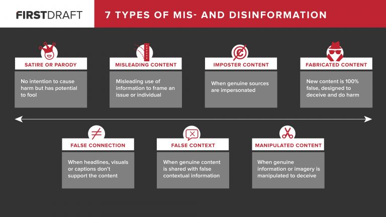

---
# You don't need to edit this file, it's empty on purpose.
# Edit theme's home layout instead if you wanna make some changes
# See: https://jekyllrb.com/docs/themes/#overriding-theme-defaults
layout: home
---

# How to check if a story or a fact is true?

Target group: Amateur writers/Bloggers

There are many news, information and stories flying around on the internet. Some are true, some are not and some are in the middle - not totally wrong and not totally correct.

With this easy steps you can identify false information and avoid to make certain mistakes if you write an article yourself. 

## Step 1: Look at the time stamp

* When was the information or an article published? 
* When and where was a statement made? 
* Are there several independent primary sources providing the same information at this time?

## Step 2: Is there consistency?

* Is the story logical and content consistent throughout the article?
* Does the headline fit to the story? 
* Are there any correction? Has the story been modified since first publication?

## Step 3: Is the source itself trustworthy? 

* Is the media outlet known to be serious? (Is it a satirical journal or is the outlet known for fake news?)
* Does an article fit to the authors previous style of writing? What else has she/he published? Might he be biased?
* Who is the primary source (references): Is the person an eyewitness, expert, politician, scholar, etc.? Was the information published by an institution, like the government, a NGO, IO or a company? 
  * What is the motivation to publish something? Who is behind the person/organization? Who gives the money? 

## Step 4: Methods used by the source

* Is it clear how the author got the information?
* Are there any kinds of data used? How were the information collected? 
See: http://www.statisticshowto.com/data-collection-methods/
* How has the information been processed?
* What kind of limitations could be there?

After the verification of sources there are still traps that could make you to appear not trustworthy.

## Step 5: Is there any important information missing?

* Are all sides represented?
* Can you talk to any (reliable) experts to get more information about the topic and make your article more credible?  → expert database (www.etis.ee)

## Step 6: Take a step back

Ask yourself what is my bias? Is there anything I have not considered yet because of my bias?

## Step 7: Publish

Is my article easy to understand?
Do I have references? Is everything transparent?

## Step 8: Engage with your readers!

To check pictures or videos that might be an useful tool for you:

[Visual verification guide](https://firstdraftnews.com/resource/visual-verification-guide-photos/)

Use fact-check websites:

[database]

